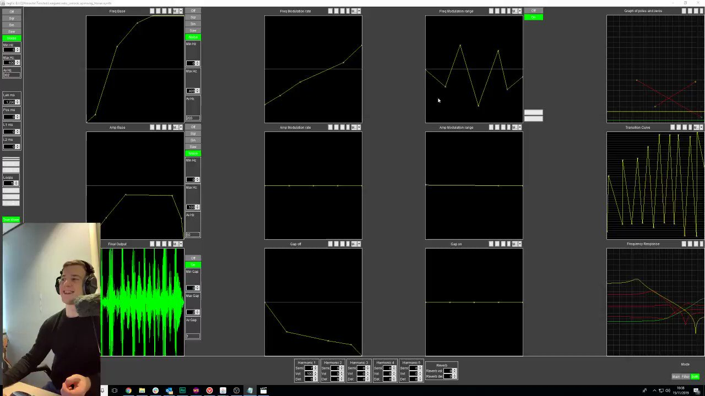

# JagFX-Editor (v3)
## An advanced editor for the JagFX sound effects format, widely used in RuneScape 2 and Old School RuneScape. Built with JDK 24.0.1 in IntelliJ.

### The official JagFX editing program for reference, used by the Jagex Audio Team to create their own sound effects:

## I used the above image as a reference to create the new and improved (But unofficial)...

# JagFX-Editor!

## So, how does this dark magic even work?!

* **Jagex Sound Effect Structure:**

    * Supports up to 10 individual `SoundTone` objects per `SoundEffect`.

    * Each `SoundTone` is highly customizable with:

        * **Main Parameters:** Duration, offset, delay time, and delay decay.

        * **Oscillators:** Up to 5 independent oscillators, each with adjustable volume, pitch, and delay.

        * **Envelopes:** Mandatory Pitch and Volume envelopes, and optional Pitch Modifier, Pitch Modifier Amplitude, Volume Multiplier, Volume Multiplier Amplitude, Release, and Attack envelopes for complex sound modulation. Each envelope supports various forms (Square, Sine, Triangle, Noise, Off) and start/end values.

        * **Sound Filter:** A `SoundFilter` allows for frequency response shaping with adjustable "pairs" (coefficients) and "unity" values.

* **Intuitive User Interface:**

    * Dark theme with green accents for a modern aesthetic.

    * **Sound Tone List:** Manages up to 10 distinct sound tones (add, remove, select).

    * **Parameter Panels:** Central area with dedicated panels for:

        * Global `SoundTone` parameters (duration, offset, delay).

        * Individual oscillator parameters (volume, pitch, delay).

        * Detailed envelope controls for each type of envelope.

        * Sound filter configuration, including dynamic input for coefficients.

    * **Real-time Visualizations:**

        * Dynamic graphs for all envelopes, showing their shape and value changes.

        * Simplified frequency response graph for the active sound filter.

        * Real-time waveform display of the selected tone or the full sound effect, reflecting adjustments instantly.

* **Core Functionality:**

    * **Real-time Feedback:** All parameter adjustments are debounced and immediately update visualizations.

    * **Audio Playback:**

        * "Play Full Effect" to hear the combined sound effect.

        * "Play Selected Tone" to isolate and play an individual tone.

        * "Stop Sound" to halt playback.

    * **File Management:**

        * **Save as JagFX:** Exports the current sound effect to a custom `.jfx` binary file.

        * **Import JagFX:** Loads sound effects from `.jfx` or `.dat` files.

        * **Export to WAV:** Converts the entire sound effect to a standard `.wav` audio file for external use.

    * **Bit Depth Selection:** Supports 8-bit and 16-bit audio playback and export.

## Why?

### I am very passionate about the MIDI engine used in Old School RuneScape and RuneScape audio in general, but there just seems to be a small piece of knowledge missing... That's right, I knew how to *decode* their sound effects to standard audio, but hadn't taken the time to *encode* or figure out a way to build custom sound effects compliant with their in-house format.

## That's it for now - Enjoy the dark art of JagFX!